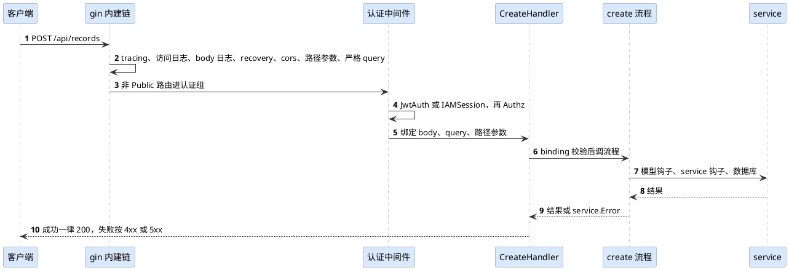
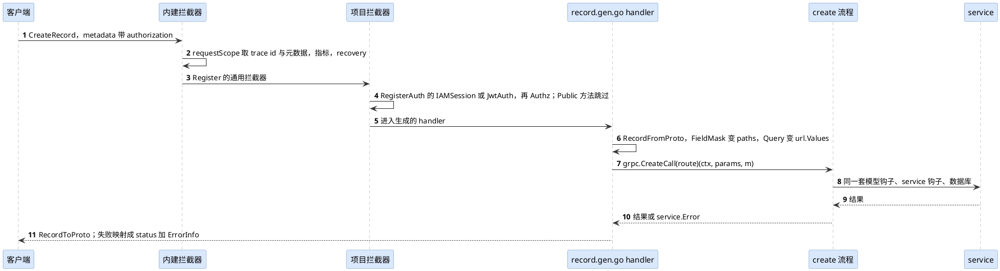
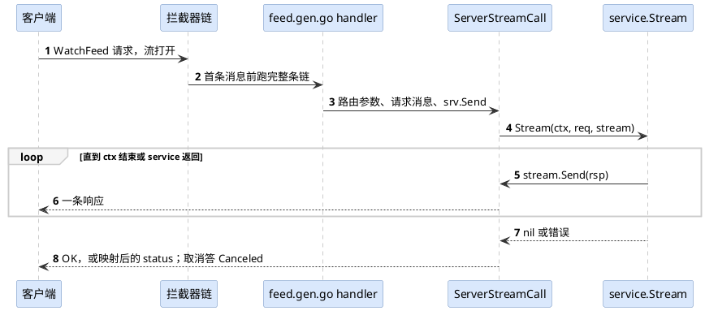

# gst 双传输架构

gst · HTTP 与 gRPC 两条传输线

一份模型声明，两条传输线：HTTP 经 gin 与 router，gRPC 经生成的 pb 适配层与拦截器链，在 controller 汇合成同一套 CRUD 流程，最后到达只写一份的 service 代码。下面按「声明 → 生成 → 注册 → 监听与链 → 分发与适配 → 共用流程 → service」七层摊开，左栏只属于 HTTP，右栏只属于 gRPC，中栏两边共用。

这页只画全景：每一层是什么、谁负责、怎么接到下一层。参数、文案、边界情况这些细节不进来，以代码和各包的注释为准。

## 1. 总览：三栏七层

  
  
gst 双传输架构：HTTP 线 · 共用 · gRPC 线

  

    

HTTP 线

两边共用

gRPC 线

    

      
① 声明 · 开发者写 model

      
<b>model/**/*.go：结构体 + Design()</b><ul><li>字段带 <code>json</code>、<code>gorm</code>、<code>pb</code> 三种 tag；<code>pb</code> 是 gRPC 字段号，Base 字段固定占 1–10，业务字段从 11 起，缺号由 gg gen 补上。</li><li><code>Design()</code> 顶层：<code>Migrate()</code>、<code>GRPC()</code>、<code>Endpoint()</code>、<code>Param()</code>、<code>Route()</code>；动作块 Create / Get / List / Update / Patch / Delete 及四个 Many、Import / Export / SSE、Stream。</li><li>块内关键字：<code>Public()</code>、<code>Exact()</code>、<code>Flatten()</code>、<code>Service()</code> 或 <code>Service("name")</code>、<code>Payload[T]()</code>、<code>Result[T]()</code>、<code>StreamingPayload[T]()</code>、<code>StreamingResult[T]()</code>。</li><li><code>internal/dsl</code> 在 gg 阶段解析并校验：非函数字面量的块、非关键字语句、流式动作没开 GRPC()、Service 名撞车，都在生成前报错。</li></ul>

    

    
▼

    

      
② 生成 · gg gen

      

<b>router/router.gen.go</b><ul><li>每个模型一条 <code>router.Register[M,REQ,RSP](group, route, cfg, phases…)</code>，路由串带 <code>/api</code> 前缀。</li><li><code>model/apidoc.gen.go</code>：Swagger 注释，服务启动后在 <code>/docs/index.html</code>。</li></ul>

<b>main.go、model.gen.go、service.gen.go、骨架</b><ul><li><code>main.go</code> 空导入 configx / cronjob / middleware / interceptor / pb 并调 bootstrap。</li><li><code>model/model.gen.go</code>：模型注册与 <code>XxxCols</code> 列引用。</li><li><code>service/service.gen.go</code>：<code>service.Register[*svc](phase, "/api/…")</code>，键是 route|phase。</li><li>新 service 文件旁生成 <code>_test.go</code> 骨架（含 main_test.go），Stream 的骨架直接拨 gRPC。</li></ul>

<b>pb/ 镜像 model 目录</b><ul><li><code>x.proto</code>：从 Go 类型与 Design() 推导；对照已提交文件拒绝改号、改类型，自动写 <code>reserved</code>。</li><li>进程内 protocompile 编译，经 <code>gghelper.PinnedCommand</code> 驱动 protoc-gen-go / protoc-gen-go-grpc 得到 <code>x.pb.go</code>、<code>x_grpc.pb.go</code>。</li><li>gg 自己写 <code>x.gen.go</code>（适配层）与 <code>pb/pb.gen.go</code>（注册）。</li><li>gg check 查 pb tag，gg prune 清 pb/ 里的过期产物。</li></ul>

    

    
▼

    

      
③ 注册 · 进程 init，两边写进同一张服务表

      

<b>router.Register → gin 路由</b><ul><li>每个 phase 一个 <code>controller.XxxHandler</code>（CreateHandler … DeleteManyHandler、Import / Export / SSE）。</li><li>Public 路由挂根组，其余挂认证组。</li></ul>

<b>注册表与模块</b><ul><li>服务注册表（<code>internal/serviceregistry</code>）按 route|phase 存 service，重复注册 panic。</li><li>模型注册表；模块 <code>iam.Register()</code>、<code>authz.Register()</code> 只注册模型与路由。</li><li>项目在 <code>middleware/middleware.go</code>、<code>interceptor/interceptor.go</code> 里显式挂认证检查。</li></ul>

<b>pb.gen.go → grpc.Register</b><ul><li><code>grpc.Register[S](RegisterXServiceServer, XService{}, grpc.Method{Name, HTTPMethod, Route, Public}…)</code>。</li><li><code>grpcserver</code> 记下每个 rpc 对应的 HTTP 动作与 <code>/api/…</code> 路由，供鉴权与日志用。</li></ul>

    

    
▼

    

      
④ 监听与链 · bootstrap 起两个监听

      

<b>gin，[server] 默认 8080</b><ul><li>内建链 <code>middleware.Builtin()</code>：tracing → accessLogger → bodyLogger → recovery → cors → routeParams → strictQuery。</li><li>再挂 <code>middleware.Register</code> 的通用中间件；认证组再挂 <code>middleware.RegisterAuth</code> 的（JwtAuth / IAMSession / Authz）。</li></ul>

<b>bootstrap</b><ul><li><code>router.Init()</code> 装好路由后 <code>RegisterGo(router.Run, grpcserver.Run)</code> 并行起监听。</li><li>logger、metrics、otel、database、redis 两边共用同一份初始化。</li></ul>

<b>grpc.NewServer，[grpc] 默认 8081</b><ul><li>一元链与流链同序：requestScope → 指标 → recovery → <code>interceptor.Register</code> 的通用拦截器 → <code>interceptor.RegisterAuth</code> 的鉴权拦截器（Public 方法与 health、reflection 不经过）。</li><li>OTEL 开着时加 otelgrpc stats handler；health 服务、反射（可关）、keepalive、TLS。</li><li>没有注册任何服务就不开监听。</li></ul>

    

    
▼

    

      
⑤ 分发与适配 · 把请求变成流程的参数

      

<b>controller.XxxHandler（gin.HandlerFunc）</b><ul><li>从 gin 取路径参数、query（urlquery 解析 <code>field[op]</code>、<code>_sort_by</code>、<code>_page</code>）、JSON body。</li><li>自定义 Payload / Result 的动作走 <code>serviceHandler</code>：Get / List 不绑 body，Create 遇 multipart 不绑。</li></ul>

<b>action 与 call</b><ul><li><code>action</code>：某模型在某条路由上的一个动作，两种传输共用；查服务表、建 span。</li><li><code>call</code>：WithParams、控制器 span，错误统一经 refuse / invalid / fail / failService 映射，各传输给自己的文案。</li></ul>

<b>pb/x.gen.go 的 handler</b><ul><li><code>XFromProto(req)</code> → <code>grpc.CreateCall[M](route)(ctx, params, m)</code> 等十个工厂，自定义动作 <code>ServiceCall[M,REQ,RSP](phase, route)</code>，都薄转发到 <code>internal/controller</code>。</li><li>FieldMask → paths；<code>grpc.Query / Filters</code> 渲染成 url.Values，走 HTTP 同一套解析；结果 <code>XToProto</code>。</li><li>流：<code>ServerStreamCall / ClientStreamCall / BidiStreamCall</code>。</li></ul>

    

    
▼

    

      
⑥ 共用流程 · internal/controller

      
<b>十个 CRUD 流程（create.go … delete_many.go、flow.go）</b><ul><li>模型钩子（CreateBefore …）与 service 钩子（Filter、ListAfter …）按同一顺序跑，事务与审计在这一层。</li><li><code>types.ServiceContext</code> 与传输无关，元数据来自 <code>requestctx.Metadata</code>：ClientIP、UserAgent、Host、TLS、Route、Path、Method、RequiresAuth；gRPC 侧 Method 固定 POST、Path 是 FullMethod。</li><li>校验单点：binding tag 整体校验；Patch / PatchMany 只校验被点名的字段（HTTP 按 body 键，gRPC 按 update_mask）；批量逐条校验。</li><li>数据库经 <code>database.Database[T](ctx)</code>，列名只来自 gorm schema。</li></ul>

    

    
▼

    

      
⑦ service · 业务代码只写一份

      
<b>service.Base[M, REQ, RSP] 与 Service("name") 的结构体</b><ul><li>标准动作：嵌 <code>service.Base</code>，按需覆盖钩子；自定义动作：<code>Create(ctx, req) (rsp, error)</code> 这类方法。</li><li>流式动作：<code>Stream(ctx, req, stream)</code> 三种签名之一，只在 gRPC 上被调用。</li><li>service 代码不 import gin 与 grpc；还能感知到传输的只剩 ServiceContext 元数据的取值（gRPC 上 Method 是 POST、Path 是 FullMethod）。</li></ul>

    

  

## 2. 请求时序

同一个 Create 动作在两条线上各走一遍。差别只在前半段：谁解析请求、谁做认证；从流程开始往后完全相同。

### HTTP：POST /api/records

### gRPC：RecordService.CreateRecord

## 3. 生成产物对照

一个声明了 `GRPC()` 的 `model/record.go`，gg gen 会写出或改写这些文件。没有 GRPC() 的项目只有 HTTP 与共用两列，pb/ 与 interceptor/ 不存在。

| 层 | HTTP 线 | 两边共用 | gRPC 线 |
|---|---|---|---|
| 入口 | | `main.go`（导入与注册），`main_test.go` | main.go 多两行空导入：`pb`、`interceptor` |
| 模型 | `model/apidoc.gen.go` | `model/model.gen.go` | 模型文件里缺的 `pb` tag 由 gen 补号并回写 |
| 接口定义 | Swagger 注释，运行期出 `/openapi.json` | | `pb/record.proto`：`RecordService`，每个 rpc 独享 `XxxRequest / XxxResponse`，List 请求带 filters、分页、expand，Patch 带 `google.protobuf.FieldMask` |
| 传输代码 | `router/router.gen.go` | `service/service.gen.go` | `pb/record.pb.go`、`pb/record_grpc.pb.go`（插件写），`pb/record.gen.go`（适配层、`RecordToProto / RecordFromProto`），`pb/pb.gen.go`（注册） |
| 业务骨架 | | `service/record/<name>.go` 与同名 `_test.go`（生成一次，之后归项目） | Stream 动作的测试骨架拨 `testutil.GRPCTarget()` |
| 模块代码 | `middleware/iam_session.go`、`authz.go`（gg module copy） | module 的 model 与 service 子树 | `interceptor/iam_session.go`、`authz.go`（只在项目有 GRPC() 模型时复制） |
| 清理 | | `gg prune` | prune 认 pb/ 下的 .proto、.pb.go、.gen.go 与孤儿拦截器文件 |

## 4. 身份、鉴权与错误

认证与授权的判定各只有一处实现，两条线各自只做「凭证从哪取、拒绝怎么答」。

| 环节 | HTTP | gRPC | 共用的实现 |
|---|---|---|---|
| 挂载 | `middleware.RegisterAuth(middleware.IAMSession(), …)`，只作用于非 Public 路由 | `interceptor.RegisterAuth(interceptor.IAMSession(), …)`，selector 放过 Public 方法与 health、reflection | 项目在自己的 middleware/ 与 interceptor/ 注册文件里显式挂，链按注册顺序跑 |
| 凭证 | IAMSession 读会话 Cookie，JwtAuth 读 `Authorization: Bearer` 头 | 两者都读 metadata `authorization: Bearer …`，经 `grpc.Bearer(ctx)` 取；会话经 gRPC 使用时登录的 user-agent 要和 gRPC 客户端一致，设备绑定按它比对 | |
| 会话认证 | `middleware.IAMSession()` | `interceptor.IAMSession()` | `serviceiamsession.Authenticate(ctx, sessionID, userAgent, method, path)`：加载、校验、设备绑定按 user-agent 比对、用户状态、改密豁免、续期 |
| JWT | `middleware.JwtAuth()` | `interceptor.JwtAuth()`，拒绝一律 Unauthenticated | jwt 包解析与校验 |
| 授权 | `middleware.Authz()`，obj 是请求的具体路径（`/api/records/42`）、act 是 HTTP 方法 | `interceptor.Authz()`，obj 是注册时记下的路由模式（`/api/records/:id`）、act 是该 rpc 对应的 HTTP 方法，流式动作是 STREAM | `rbac.Enforce(ctx, Subject, obj, act)`，策略只有 HTTP 那一份 |
| 调用者 | gin 上下文里的用户 | `grpc.WithCaller / CallerOf`，写进访问日志 | `execctx` 里的身份与 trace id |
| 失败的形状 | JSON 错误体，状态码取 `service.Error` 的 status | status code 加 `ErrorInfo{Reason: SERVICE_ERROR, Domain: gst, Metadata: code, status}` | `service.NewError / NewErrorWithCause`，没有业务状态码 |

HTTP 状态到 gRPC status 的映射（`grpcserver.StatusOfCoder`）：

- 400 → InvalidArgument；401 → Unauthenticated；403 → PermissionDenied；404 → NotFound；408、504 → DeadlineExceeded。
- 409 → AlreadyExists，其中乐观锁的 CodeStaleObject → Aborted；412 → FailedPrecondition；429 → ResourceExhausted；501 → Unimplemented；503 → Unavailable。
- 其他 5xx → Internal；其他 4xx → InvalidArgument；数据库未知错误与钩子里的非 service.Error → Internal「internal server error」；请求消息校验失败 → InvalidArgument「invalid request message」；panic 经 recovery → Internal。
- 客户端已取消或超时的调用答 Canceled / DeadlineExceeded，不记错误日志。

## 5. 动作承载矩阵

规则一句话：动作在能承载它的每种传输上都提供；只有一种传输能承载的，只在那一种上提供，并且写进生成产物（.proto 文件头写明只走 HTTP 的动作，路由与接口文档写明只走 gRPC 的动作）。

| 动作 | HTTP | gRPC（模型声明了 GRPC()） | 说明 |
|---|:---:|:---:|---|
| Create / Get / List / Update / Patch / Delete | ✓ | ✓ | rpc 名 = 动作名 + 模型名，嵌套路由加 `By<参数>`；不要求 Service() |
| CreateMany / UpdateMany / PatchMany / DeleteMany | ✓ | ✓ | 批量逐条校验；PatchMany 每条自带 update_mask |
| Route() 里的自定义动作 | ✓ | ✓ | rpc 名 = Service 名 + 模型名；Payload 挂成 `payload`，Result 挂成 `result` |
| Import / Export / SSE | ✓ | — | 文件流与事件流只有 HTTP 能承载；gg check 在 GRPC() 模型的其他 service 里拦住 HTTP 专属的 ServiceContext 方法（Cookie、FormFile、SSE 等），这三种动作自己的 service 文件不扫 |
| Stream | — | ✓ | 只允许自定义动作，必须 Service("name") 与 GRPC()；router、service.gen.go、TS 类型都跳过它 |

## 6. 流式动作

流是 gRPC 独有的一条支线：声明、生成、运行时各加一段，其余复用一元调用的 call 与错误映射。

声明与生成：

- `Stream(func(){ Service("watch"); Payload[*Req](); StreamingResult[*Rsp]() })`：Payload / Result 写一问一答的一侧，Streaming 版写流的一侧，至少一侧是流，三种组合都支持。
- .proto：`rpc WatchFeed (WatchFeedRequest) returns (stream WatchFeedResponse)`；请求消息开头仍是路由参数。
- `x.gen.go`：服务端流把 `srv.Send` 交给流程；客户端流与双向流先用 `grpc.FirstMessage(srv.Recv)` 读首条消息取路由参数，再把它当第一条交回。
- authz：act 是 `STREAM`，obj 是声明的 `/api/…` 路径。

运行时与 service 签名：

- 拦截器在首条消息前跑一次，访问日志一条流记一条，状态取流结束时的。
- 请求逐条 normalize 与校验，被拒的那条让 Recv 返回错误，调用答 InvalidArgument。
- 服务端流：`Stream(ctx *gst.ServiceContext, req REQ, stream *grpc.ServerStream[RSP]) error`。
- 客户端流：`Stream(ctx, stream *grpc.ClientStream[REQ]) (RSP, error)`，对方发完 Recv 答 io.EOF。
- 双向流：`Stream(ctx, stream *grpc.BidiStream[REQ, RSP]) error`。
- ctx 取消即流结束：客户端停掉 watch 答 Canceled，不算错误。

## 7. 生命周期与观测

启动到停机：

- bootstrap 顺序：配置 → 日志 → 数据库与 redis 等 → `router.Init()`（内建链、路由、模块）→ `RegisterGo(router.Run, grpcserver.Run)`。
- gRPC 监听只在有注册服务时启动；启动时若有非 Public 方法却没挂鉴权拦截器，打一条 Warn。
- 停机：`controller.Probe.Drain()` 让 `/-/readyz` 答 503，`grpcserver.Drain()` 让 health 答 NOT_SERVING，等 shutdown_delay 过去，再按注册的逆序一个接一个跑 cleanup：先 `grpcserver.Stop`（GracefulStop 等在途调用，超时强制），后 `router.Stop`。
- 多副本下客户端靠这两个探针切走流量；k8s 的 readinessProbe 打 HTTP，gRPC 的 native health probe 打 health 服务。

观测两边对齐：

- 访问日志：HTTP 写 access.log，gRPC 由 requestScope 写 grpc.log，字段对齐；gRPC 的 status 记状态码名，失败再加 error 字段。
- 指标：HTTP 是 `gst_backend_*`，gRPC 保持库默认 `grpc_server_*`，方便现成看板。
- 追踪：HTTP 的 tracing 中间件与 gRPC 的 otelgrpc 各起服务端 span，trace id 都盖进 ctx；没带 W3C 头时两边都认 X-Trace-ID，gRPC 还回写 `x-trace-id`。
- panic：两边共用 logger.Recovery 写 recovery.log，并记在 span 上。
- 测试：`testutil.Run` 同时起两个空闲端口的监听，`testutil.GRPCTarget()` 给 `grpc.NewClient`。

## 8. 包与文件地图

项目开发者只看得到公开包；internal 里是框架自己的实现。`dsl`、`router`、`service` 只做转发；`middleware` 与 `grpc` 除了转发，还带项目直接用的实现（JwtAuth、IAMSession、Authz、限流与超时这些中间件，`Bearer` 与消息转换函数）。

| 包 | 归属 | 职责 |
|---|---|---|
| `dsl` → `internal/dsl` | 共用 | 关键字、解析、校验；`HTTPOnlyAction`、`GRPCOnlyAction` 是「哪种传输承载」的单点 |
| `internal/modelinfo` | 共用 | 模型元信息：路由、参数、`RPCName`、`PBPackage`，pb 生成与骨架共用 |
| `internal/gggen` | 共用 | 所有生成器；子包 `pb` 出 .proto、适配层与注册文件并驱动插件 |
| `internal/ggcheck`、`ggprune`、`ggmodule` | 共用 | 业务项目的静态检查、过期产物清理、模块复制（中间件与拦截器一起管） |
| `internal/gghelper` | 共用 | gg 的运行帮手；`PinnedCommand` 把固定版本的 protoc 插件与 golangci-lint 编到用户缓存目录再运行 |
| `router` → `internal/router` | HTTP | gin 引擎、路由注册、认证组、Run / Stop |
| `middleware` → `internal/middleware` | HTTP | 内建链、`Register / RegisterAuth`；公开包另带 JwtAuth、IAMSession、Authz 等 |
| `internal/controller` | 共用 | HTTP handler、gRPC 调用工厂、流的运行时、十个 CRUD 流程、校验与错误映射 |
| `grpc` | gRPC | 生成代码与项目用的入口：`Register`、`Method`、十个 `XxxCall`、`ServiceCall`、三种流、转换函数、`Bearer / WithCaller / CallerOf / Route / StatusError` |
| `interceptor` | gRPC | `Register / RegisterAuth`、`JwtAuth`，以及随 module copy 复制进项目的 `IAMSession`、`Authz` |
| `internal/grpcserver` | gRPC | 监听、拦截器链、requestScope、recovery、指标、health 与反射、状态映射、Drain / Stop |
| `internal/requestctx`、`internal/types` | 共用 | 请求元数据与 `ServiceContext`、流对象接口，两种传输各自填充 |
| `internal/service/iam/session`、`authz/rbac` | 共用 | `Authenticate` 与 `Enforce`：会话认证与授权判定的唯一实现 |
| `testutil` | 共用 | 真容器、两个监听、`GRPCTarget()` |
| `examples/demo`、`examples/cluster` | 共用 | demo 是入门示例（gRPC 示例在 model/board），cluster 是多副本、gRPC 与会话认证的实弹验证项目 |

这页跟着代码走：拦截器链、映射表、产物名以仓库为准，改了代码就改这页。
