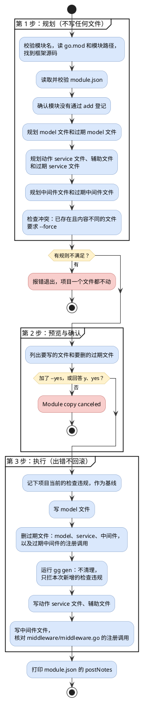
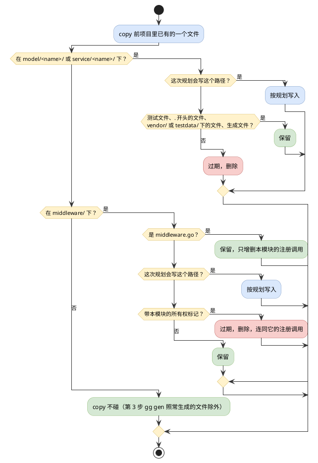

# gg module 命令

`gg module` 管理框架自带的模块，有四个子命令：`list` 列出模块；`add`、`remove` 在项目里登记、取消登记一个模块；`copy` 把模块的源码复制进项目，之后这些代码归项目所有。本文说明每个子命令做什么、按什么顺序做、会写或删哪些文件、什么情况下报错。

## 总览

| 命令 | 做什么 | 会改的文件 |
| --- | --- | --- |
| `gg module list` | 列出框架模块，以及每个模块支持哪种接入方式 | 不改任何文件 |
| `gg module add <name>` | 在 `module/module.go` 里导入模块，并调用它的 `Register()` | `module/module.go` |
| `gg module remove <name>` | 撤掉 `add` 写的导入和 `Register()` 调用 | `module/module.go` |
| `gg module copy <name> [--force] [--yes]` | 把模块的 model、service、中间件源码复制进项目，并删掉模块源码里已经没有的过期文件 | `model/<name>/`、`service/<name>/`、`middleware/` 下的文件，`middleware/middleware.go`，以及 `gg gen` 重新生成的文件 |

模块有两种接入方式，二选一：

- **add（登记）**：代码留在框架里，项目只导入模块、调用 `Register()`，升级 gst 时模块跟着升级。
- **copy（复制）**：源码复制进项目后就是项目自己的代码，可以直接修改、裁剪。

同一个模块不能两种方式同时用：已经 add 的模块不能 copy，项目里已有它的源码时也不能 add。

## 框架源码从哪里来

四个子命令都要读框架源码里的 `module/` 目录。框架源码的位置由 Go 模块图决定：gg 运行 `go list -m -f '{{.Dir}}' github.com/hydroan/gst`，项目编译用的是哪份 gst，就读哪份。

- `go.mod` 只是普通 require 时，读模块缓存里的那个版本；
- 有 replace 时，读 replace 指向的目录；
- 在 gst 仓库里运行时，读仓库本身。

模块缓存里还没有这份源码时，gg 先运行 `go mod download github.com/hydroan/gst` 再查一次；仍然找不到，或者项目根本没有依赖 gst，就报错退出。

所以 copy 出来的代码永远和项目当前编译的 gst 版本一致。想 copy 一个还没发布的模块改动，要先在项目的 `go.mod` 里把 gst replace 到本地源码。

## 几个说法

**模块**：框架 `module/<name>/` 目录下的 `register.go` 声明了 `func Register`，这个目录就是一个模块，`<name>` 是模块名。模块清单从框架源码里现找，不另外维护。

**模块名**：命令只接受模块名本身，不接受路径：不能为空，前后不能有空白，不能以 `.` 开头，不能含 `/` 或 `\`。例如 `gg module add model/email` 报错 `module command accepts a module name, not a path: model/email`。

**可 add**：`Register` 不带参数，或者只有一个可变参数（`...`），gg 才能替你写出 `<包名>.Register()`。要传参数的模块只能手写登记。

**可 copy**：模块目录里有 `module.json`（复制清单），见「module.json」一节。

**生成文件**：`package` 语句之前有一行 `// Code generated ... DO NOT EDIT.` 的 Go 文件，例如 `gg gen` 生成的列引用文件。

**所有权标记**：copy 写进 `middleware/` 的每个文件，第一行都是

```
// Managed by gg module copy (module <name>). Removing the module removes this file.
```

`middleware/` 里还放着项目自己的中间件和别的模块复制来的文件，只有带着本模块这行标记的文件，copy 才认作自己的，才可能删掉。整个模块被删掉之后，prune 也靠这行标记认出它留下的中间件文件，见「删除复制来的模块」。

## gg module list

打印 `Framework Modules` 表格，按模块名排序：

| 列 | 含义 |
| --- | --- |
| `NAME` | 模块名，即 `module/` 下的目录名 |
| `PACKAGE` | `register.go` 声明的包名，可能和目录名不同，例如 `version` 模块的包名是 `versionmod` |
| `ADD` | 能不能用 `gg module add` 登记 |
| `COPY` | 能不能用 `gg module copy` 复制 |
| `IMPORT` | 登记时导入的路径 |

`ADD`、`COPY` 两列说的是模块**支持**哪种接入方式，不是项目**已经**用了哪种。

## gg module add

1. 校验模块名，找到模块。找不到时报 `module "<name>" not found`；模块不可 add 时报 `module "<name>" cannot be added automatically because Register requires arguments`。
2. `model/<name>/` 或 `service/<name>/` 下有任何非测试的 Go 文件时报错：项目里已经有这个模块的源码，再登记框架版本就成了两份实现。
3. 读 `module/module.go`，文件不存在时报错。
4. 已经登记过——导入了这个模块，并且某个 `init` 函数里调用了它的 `Register`——就打印 `SKIP <name> already registered in module/module.go`，文件不动。
5. 否则：还没有导入就加上导入，包名和目录名不同时带上别名；在第一个 `init` 函数末尾追加 `<包名>.Register()`，没有 `init` 函数就新建一个。用 gofumpt 格式化后写回，打印 `ADD <name> registered in module/module.go`。

## gg module remove

1. 同 add 第 1 步：校验模块名，模块必须可 add。
2. 读 `module/module.go`，文件不存在时报错。没有登记（没有导入，或者 `init` 函数里没有它的 `Register` 调用）时报 `module "<name>" is not registered as a framework module`。
3. 删掉 `init` 函数里不带参数的 `<包名>.Register()` 调用。登记用的是带参数的调用时，gg 不替你判断，报错让你手动删。
4. 删掉导入，写回文件，打印 `REMOVE <name> unregistered from module/module.go`。

remove 不删任何 model、service 文件。对默认模板，add 之后再 remove，`module/module.go` 会还原成原样。

## gg module copy

copy 分三步：先规划，再预览并确认，最后执行。规划不写任何文件，规划中任何一条规则不满足都直接报错，项目一个文件都不动。



### 第 1 步：规划

按顺序：

1. 校验模块名，规则同 add。
2. 当前目录必须有 `go.mod`，也就是要在项目根目录运行；读出项目的模块路径。
3. 找到框架源码，见上文。框架里必须有 `module/<name>/`、`internal/model/<name>/`、`internal/service/<name>/` 三个目录。
4. 读取并校验 `module/<name>/module.json`，没有这个文件就报错（模块不可 copy）。`includeSourceFiles` 和 `middleware` 的条目在这一步就逐条核对，规则见「module.json」。
5. 检查 `module/module.go`：导入了这个模块，并且文件里任何地方调用了它的 `Register`（带不带参数都算），就报 `framework module <name> is already registered; remove it before copying local source`；用 `.` 导入了这个模块也报错。这里的判断比 add 判断「已登记」更宽：只要像是登记，就拦下 copy。已经 add 的模块要先 remove。
6. 规划 model 文件，见「model 文件」。
7. 规划 service 文件，见「service 文件」。
8. 规划中间件文件，见「中间件」。
9. 检查冲突：目标位置已经有文件、内容又和要写的不同时，没加 `--force` 就报 `<path> already exists; use --force to overwrite`。内容相同的文件不需要 `--force`。

#### model 文件

- **镜像复制**：`internal/model/<name>/` 下的 Go 源文件（含子目录）复制到 `model/<name>/` 下相同的相对路径。跳过测试文件、以 `.` 开头的文件、`vendor/` 和 `testdata/` 目录，以及 `excludeSourceFiles` 列出的文件。
- **排除的文件不能被引用**：清单排除了 model 文件时，gg 先对框架的 model 目录做类型检查；被复制的文件引用了被排除的文件，就报错并指出是哪两个文件。
- **读 DSL**：用和 `gg gen` 相同的解析器读这些 model 的 `Design()`，下一步据此规划 service 文件。
- **过期 model 文件**：见「过期文件」。

#### service 文件

service 目录不是镜像复制，分两类文件。

**动作 service 文件**，放 DSL 动作的业务逻辑：

- 每个 model 的 `Design()` 里启用且带 `Service()` 的动作，源文件是框架 `internal/service/<name>/` 下按 `gg gen` 规则算出的文件，目标是项目 `service/<name>/` 下按同一规则算出的文件，正好是之后 `gg gen` 会生成它的位置。
- 源文件被 `excludeSourceFiles` 排除的动作跳过。
- 源文件必须存在，并且至少声明一个 service 结构体（嵌入 `service.Base` 的结构体）。只有钩子方法、没有动作主方法也可以。
- 几个动作对应同一个文件名时，合并成一个目标文件。
- 目标内容是先生成一份和 `gg gen` 一样的 service 外壳，再把框架源文件合并上去：
  - 外壳决定 `package`、import 布局、service 结构体名和生成的动作方法签名；
  - 源文件提供方法体、钩子方法、结构体上的其他方法、普通声明和注释。方法体嫁接到生成的签名上时，接收者、参数、返回值改用生成的名字；
  - 源文件里的 service 结构体全部并到外壳的那一个结构体上，两个源结构体上有同名方法时报错；
  - 源文件的 import 并进外壳。结构体替换后没人用的 import 会删掉，前提是能从源文件里确认它的包名；删不掉又没人用的框架或项目 import 报错；
  - 同样套用下面的改写规则。

**辅助文件**，动作代码用到的其他整个文件：

- 从动作源文件和 `includeSourceFiles` 出发，对框架整个 `internal/service/<name>/` 目录做类型检查（这个目录必须能编译）。被引用的顶层声明在哪个文件，就把那个文件整个加入复制，再从新加入的文件接着找，直到找不出新文件。引用可以跨子包。
- 空白导入（`import _`）的本模块子包，整个包的文件都加入；被排除的文件和声明了 service 结构体的文件除外。
- 引用了被排除的文件，或者引用了一个声明了 service 结构体、却不被任何动作复制的文件，都报错：共享代码要放进辅助文件。
- 辅助文件套用改写规则后整个写入。

**过期 service 文件**：见「过期文件」。

#### 中间件

只复制 `module.json` 的 `middleware` 里声明的文件，不做发现：

- 源文件必须是框架 `middleware/` 下的非测试 Go 文件，目标固定是项目 `middleware/` 下的同名文件。
- `handler` 必须是源文件里一个不带参数的顶层函数。`scope` 为 `global` 时注册成 `middleware.Register(<handler>())`，为 `auth` 时注册成 `middleware.RegisterAuth(<handler>())`。
- 文件套用改写规则（中间件可以引用复制来的 model、service 包），再在最前面加上所有权标记。
- **过期中间件文件**：见「过期文件」。

#### 改写规则

复制的每个文件都不是原样照搬：

- `package` 改成目标目录名（去掉标识符里不允许的字符），例如 `internal/model/email` 下的 `package modelemail` 变成 `model/email` 下的 `package email`。
- 对本模块 model 目录的导入（`github.com/hydroan/gst/internal/model/<name>/...`）改成项目的 `model/<name>/...`；service、辅助、中间件文件还把本模块 service 目录的导入（`github.com/hydroan/gst/internal/service/<name>/...`）改成项目的 `service/<name>/...`。model 文件里对 service 目录的导入不改：model 引用 service 本身违反分层，留着它会在最后一条规则报错。
- 改写后的导入按新路径的最后一段起名。和同文件的其他导入重名时，加 `model` 或 `service` 前缀做别名（例如 `modelsession`），还重名就在后面补 `x`。代码里的包名前缀跟着改。
- 改写后的包名前缀如果被同一个文件里的同名声明遮住（例如函数里有个局部变量也叫 `session`），报错，要在模块源码里给那个声明改名。
- 改写完仍然导入 `github.com/hydroan/gst/internal/...` 的文件报错：这种导入在框架里能编译，放进项目就不能。

### 第 2 步：预览与确认

先打印 `Module Copy Plan`，分组列出要写的文件：`Model files`、`Service files`、`Helper files`、`Middleware files`，空组不显示。有过期文件时，再分别在 `Stale Target Model Files`、`Stale Target Service Files`、`Stale Target Middleware Files` 下列出要删的文件。

然后问 `Copy module <name> into the current project? (y/N):`。回答 `y` 或 `yes`（不分大小写）才继续；其他回答，包括直接回车，打印 `Module copy canceled`，什么都不做。加了 `--yes` 就不问，直接执行。

预览里列出的过期文件就是执行时要删的全部文件，回答 `y` 就是同意删除它们。`--force` 只管覆盖内容不同的文件，和删除无关。

### 第 3 步：执行

写任何文件之前，先记下项目当前 gg check 的全部违规，作为基线。然后按顺序：

1. **写 model 文件**（`Copy Model Files`）。
2. **删过期文件**（`Prune Stale Files`，有过期文件时才有这一段）：删过期的 model、service 文件；删过期的中间件文件，同时从 `middleware/middleware.go` 删掉调用这些文件里函数的 `Register`、`RegisterAuth` 语句，框架 middleware 包的导入没人用了也一并删掉。已经不在的文件算删过。这一步放在 `gg gen` 之前，因为过期的 model 文件还带着 DSL，`gg gen` 会照样为它生成注册代码。
3. **运行 gg gen**：和 `gg gen` 同一套生成流程，但不打印生成文件的日志，不做 prune，也不清理孤儿目录；生成前的项目检查只拦本次 copy 新引入的违规，基线里已有的不拦。
4. **写动作 service 文件**（`Copy Service Files`）。
5. **写辅助文件**（`Copy Helper Files`，有辅助文件时才有）。
6. **写中间件文件**（`Copy Middleware Files`，模块声明了中间件时才有）。
7. **核对中间件注册**（`Register Middleware`），让 `middleware/middleware.go` 和 `module.json` 一致：
   - 本模块拥有的 handler 是写入前后本模块中间件文件里的顶层函数。它们的注册调用如果不在声明的（handler，scope）组合里，就删掉；改 scope 或改 handler 名时，旧调用就是这样被清掉的。
   - 每个声明的组合都确保有一条注册调用。
   - 不属于本模块的 handler 的调用一律不碰。
   - 文件不存在时新建一个只有 `package middleware` 的文件；文件里已经导入了框架 middleware 包时沿用它的别名；没有任何变化时不写文件。

全部成功后打印 `Done`、`Module copied successfully`、删除模块的提示（见「删除复制来的模块」），最后逐行打印 `module.json` 的 `postNotes`。

执行不回滚：已经写入或删除文件之后出错，写了、删了的保持原样，命令打印删除模块的提示后报错退出。

每写一个文件打印一个状态：

| 状态 | 含义 |
| --- | --- |
| `CREATE` | 新建文件 |
| `UPDATE` | 覆盖了内容不同的已有文件。copy 开始前就存在的文件，要加 `--force` 才会覆盖；动作 service 文件的外壳是本次第 3 步 `gg gen` 刚生成的，直接覆盖，所以首次 copy 时动作 service 文件显示的都是 `UPDATE` |
| `SKIP` | 内容已经一样，没动 |
| `DELETE` | 删掉了过期文件 |

写每个文件之前会再核对一次冲突：规划之后文件被改了，没加 `--force` 仍然不会覆盖。

模块源码没变时重复执行同一个 copy，所有文件都是 `SKIP`，也没有过期文件。

### 过期文件

copy 让复制来的目录和模块源码保持一致：旧版本 copy 写过、这一次不再写的文件就是过期文件，执行时删除。按目录分两种判断：

- **`model/<name>/`、`service/<name>/`**：这两个目录镜像模块源码，这次规划不写的 Go 文件都算过期。例外：测试文件、以 `.` 开头的文件、`vendor/` 和 `testdata/` 目录下的文件，以及生成文件，永远不算过期。项目自己的代码应放在这两个目录以外。
- **`middleware/`**：这个目录是共用的，只有带着本模块所有权标记、而 `module.json` 已经不再声明的文件才算过期；`middleware/middleware.go` 永远不算。



### module.json

`module/<name>/module.json` 是模块的复制清单，所有字段都在 `copy` 下。路径字段一律写相对框架根目录的路径，绝对路径和 `..` 开头的路径都报错。

| 字段 | 作用 | 校验 |
| --- | --- | --- |
| `excludeSourceFiles` | copy 完全跳过的源文件：不复制，也不参与 model 和动作的规划。被排除的动作 service 文件，它的动作也不复制；项目里以前复制过的这类文件算过期文件。被复制的代码还引用着它时报错 | 路径安全 |
| `includeSourceFiles` | 即使没有动作引用，也必须作为辅助文件复制的文件，给只被项目自己的装配代码调用的钩子实现用 | 必须在 `internal/service/<name>/` 下、存在、不是测试文件、没被排除、没有声明 service 结构体 |
| `middleware` | 要复制的中间件，每项有 `sourceFile`、`scope`、`handler`，见「中间件」 | `sourceFile` 必须是 `middleware/*.go` 的非测试文件；`scope` 只能是 `global` 或 `auth`；`handler` 必须是合法的 Go 标识符，并且是源文件里一个不带参数的顶层函数 |
| `requiredAssembly` | copy 之后项目必须自己写的调用，每项有 `import`、`function`、`reason`。gg check 的「Module assembly」检查项据此要求项目在非测试代码里调用它们 | 三个字段都不能为空；`function` 必须是导出的 Go 标识符 |
| `postNotes` | copy 成功后逐行打印的提示，写 copy 自动化不了的后续步骤 | 去掉首尾空白，空行丢弃 |

## 删除复制来的模块

copy 成功结束时，以及执行中途在写入或删除文件之后出错时，会提示：

```
To remove copied module code, delete model/<name>, then run: gg gen --prune --clean-orphans
```

删掉 `model/<name>/` 后，模块的动作不再存在，`gg gen --prune --clean-orphans` 会删掉对应的 service 文件和孤儿目录。这个模块复制来的中间件文件成了孤儿中间件文件，也在同一步里删掉，`middleware/middleware.go` 里它们的注册调用一并删掉。清理规则见 [PRUNE.md](PRUNE.md)。

## 终端输出的段落标题

| 标题 | 什么时候出现 |
| --- | --- |
| `Framework Modules` | `gg module list` |
| `Module Copy Plan` | copy 的预览，列出要写的文件 |
| `Stale Target Model Files`、`Stale Target Service Files`、`Stale Target Middleware Files` | 预览中有对应的过期文件要删 |
| `Copy Model Files` | 执行第 1 步 |
| `Prune Stale Files` | 执行第 2 步，有过期文件时 |
| `Copy Service Files` | 执行第 4 步 |
| `Copy Helper Files` | 执行第 5 步，有辅助文件时 |
| `Copy Middleware Files` | 执行第 6 步，模块声明了中间件时 |
| `Register Middleware` | 执行第 7 步，模块声明了中间件时 |
| `Done` | copy 全部成功 |
