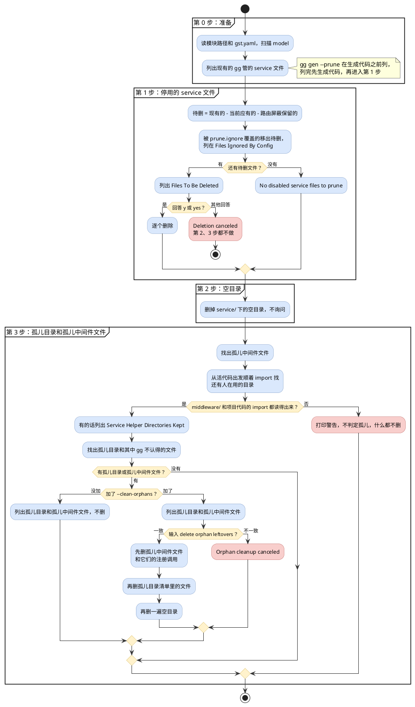
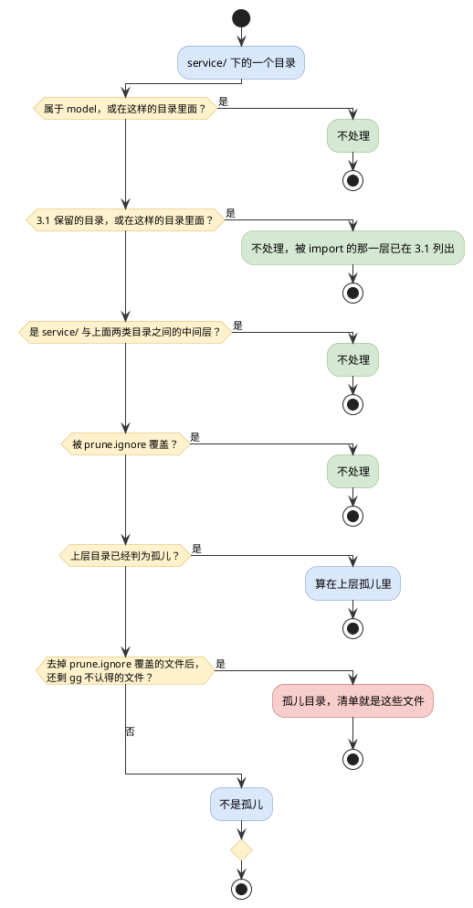

# gg prune 清理逻辑

`gg prune` 和 `gg gen --prune` 清理项目 `service/` 目录里不再需要的文件，以及被删掉的复制模块留在 `middleware/` 里的中间件文件。本文说明它们删什么、不删什么、按什么顺序删、哪一步会先问你。除了这些中间件文件和它们在 `middleware/middleware.go` 里的注册调用，`service/` 以外一个文件都不删。

**删什么只认 `prune.ignore`**：`service/` 归 gg 管，要保持干净，放在里面的东西被 Git 忽略也好、被 Go 工具链忽略也好，用不上的照样是垃圾。所以 prune 删东西时读整个 `service/`，项目的 Git 忽略规则和 Go 工具链的内置忽略（名字以 `.` 或 `_` 开头的文件和目录、`vendor`、`testdata`、自带 `go.mod` 的子目录、`go.mod` 里 `ignore` 的目录）都不保护任何路径，想保留的路径写进 gst.yaml 的 `prune.ignore`。判断某个 service 目录还有没有代码在用时，prune 和 `gg check`、`gg gen` 一样按这两类规则认项目代码：被忽略的代码不算在用，所以清理完不会留下一直删不掉的目录。

## 总览

清理分三步，按顺序进行：

1. **停用的 service 文件**：删掉 model、关掉 action，或者 action 去掉 `Service()` 之后，留在磁盘上的 service 文件。先列清单，你回答 `y` 才删。
2. **空目录**：`service/` 下的空目录直接删，不询问。
3. **孤儿目录和孤儿中间件文件**：孤儿目录是没有任何 model 对应、也没有活代码 import 的 service 目录；孤儿中间件文件是 `gg module copy` 写进 `middleware/`、所属模块已经被删掉的中间件文件。默认只列出来；加了 `--clean-orphans` 并输入确认短语，才删掉孤儿目录里 gg 不认得的文件和孤儿中间件文件，连同中间件的注册调用。

## 从哪里触发

| 命令 | 做什么 |
| --- | --- |
| `gg prune` | 只清理，不生成代码 |
| `gg gen --prune` | 先生成代码，再清理 |
| 以上两个命令加 `--clean-orphans` | 第 3 步允许删除孤儿目录里的文件和孤儿中间件文件；`gg gen` 带它时必须同时带 `--prune`，否则直接报错 |

`gg module copy` 在内部重新生成代码时不做任何清理。

## 几个说法

**gg 管的 service 文件**：`service/` 下满足下面任一条件的 `.go` 文件，测试文件（`_test.go`）除外。

- 文件名是 13 个标准动作文件名之一：`create.go`、`delete.go`、`update.go`、`patch.go`、`list.go`、`get.go`、`create_many.go`、`delete_many.go`、`update_many.go`、`patch_many.go`、`import.go`、`export.go`、`sse.go`。
- 文件里有结构体嵌入了 gg 生成的那种 `service.Base[M, REQ, RSP]`，三个类型参数都带包名，例如 `service.Base[*model.Record, *model.RecordReq, *model.RecordRsp]`。DSL 用 `Filename(...)` 改了文件名的 service 文件靠这一条认出来。

其余文件都是 **gg 不认得的文件**：手写的辅助代码、测试文件、非 Go 文件等。

**当前应有的 service 文件**：每个 model 里启用、并且声明了 `Service()` 的 action，各对应一个 service 文件。以 `model/sample/record.go` 为例：

- `Create` 对应 `service/sample/record/create.go`；
- 加了 `Filename("archive")` 时对应 `service/sample/record/archive.go`；
- 再加 `Flatten()` 时对应 `service/sample/archive.go`。

**属于 model 的目录**：当前应有的 service 文件所在的目录。`gg gen --prune` 时，被 gst.yaml `gen.routes.ignore` 屏蔽的 action，其 service 文件所在的目录也算。

**中间层目录**：`service/` 与属于 model 的目录之间的各级目录，包括 `service/` 本身。例如 `service/sample/record` 属于 model 时，`service/sample` 和 `service/` 都是中间层目录。

**孤儿候选目录**：`service/` 下既不属于 model、也不在属于 model 的目录里面、也不是中间层的目录。隐藏目录、`_` 开头的目录、`vendor`、`testdata`、自带 `go.mod` 的子目录和被 Git 忽略的目录也一样按这条判断。

**孤儿中间件文件**：`middleware/` 下带着 `gg module copy` 所有权标记（第一行是 `// Managed by gg module copy (module <name>). ...`），而项目里已经没有 `model/<name>/` 目录的文件，也就是被删掉的复制模块留下的中间件。`middleware/middleware.go` 永远不算。所有权标记见 [MODULE.md](MODULE.md)。

**prune.ignore**：gst.yaml 里的保护清单。每一项是 `service/` 或 `middleware/` 下的一个路径，按目录层级匹配：`service/legacy` 覆盖这个目录和它下面的全部内容，但不覆盖 `service/legacyx`；写到具体文件就只覆盖这一个文件。被覆盖的路径在三步里都不会被删。写法和校验规则见 README 的[项目级配置 gst.yaml](../../README.md#项目级配置-gstyaml)。

## 第 0 步：准备

`gg prune`：

1. 从 `go.mod` 读出模块路径。项目里没有 `model/` 目录时报错退出。
2. 读 gst.yaml。读之前，项目根目录下有 `.gg.yaml`、`.gg.yml`、`.gst.yaml`、`.gst.yml`、`gst.yml` 中的哪个，就对哪个打印一条警告：gg 不读它们。
3. 扫描 `model/` 下的 model，读的文件和 `gg gen` 相同：跳过被 Git 忽略的、Go 工具链内置忽略的（见开头）和测试文件。项目有哪些 model 由 `gg gen` 说了算，prune 只处理它们留下的东西。一个 model 都没找到时打印 `No models found, pruning service files only` 并照常往下走，这时所有 gg 管的 service 文件都会进待删清单。
4. 列出 `service/` 下现有的 gg 管的 service 文件，不跳过任何目录：被 Git 忽略的、`testdata` 或 `_` 开头目录里的都算。扫描中途出错只打印警告，用已经扫到的文件继续。

读不出模块路径、gst.yaml 写错（包括 `prune.ignore` 不合规）、model 文件解析失败时，`gg prune` 打印错误并以失败退出，什么都不删。

`gg prune` 不应用 gst.yaml 的 `gen.routes.ignore`：被屏蔽的 action 在这里仍算启用，它的 service 文件是当前应有的，所在目录属于 model。结果和 `gg gen --prune` 保留它们一样。

`gg gen --prune`：先跑项目检查，不通过就既不生成也不清理；再读 gst.yaml、扫描 model，并在生成代码之前列出现有的 gg 管的 service 文件；然后生成代码，最后进入第 1 步。所以这次生成新建的文件不会进待删清单。

## 第 1 步：删停用的 service 文件

1. `prune.ignore` 里指向不存在路径的条目，逐条警告 `gst.yaml prune.ignore entry "..." names no file or directory`，不中断。
2. 算出待删文件：现有的 gg 管的 service 文件，去掉当前应有的；`gg gen --prune` 时再去掉被路由屏蔽的 action 的 service 文件。
3. 待删文件里被 `prune.ignore` 覆盖的，移出待删清单，列在 `Files Ignored By Config` 下面。
4. 待删清单为空时打印 `No disabled service files to prune`（待删文件全被 `prune.ignore` 保住时是 `No disabled service files to prune (all files are ignored)`），直接进入第 2 步。
5. 否则列出 `Files To Be Deleted`，问 `Do you want to delete these files? (y/N):`。项目里有 `.gg.yaml` 或 `.gg.yml` 时，提问前再警告一次：它们不会被读取，里面列的路径在这里不受保护。
   - 回答 `y` 或 `yes`（不分大小写）：逐个删除，删掉的打印 `Deleted ...`，删不掉的打印 `Failed to delete ...` 并接着删后面的，然后进入第 2 步。
   - 其他任何回答，包括直接回车：打印 `Deletion canceled`，**整个清理到此结束**，第 2、3 步都不做。

## 第 2 步：删空目录

- 从最深的目录开始，删掉 `service/` 下的空目录；子目录删掉后变空的上层目录也一起删。`service/` 本身不删。
- 不询问，每删一个打印 `Removed empty directory ...`。
- 只有被 `prune.ignore` 覆盖的目录不删；被 Git 忽略的空目录、空的 `testdata` 目录照样删。

## 第 3 步：处理孤儿目录

### 3.1 找出还有活代码在用的目录

**活代码**指 `gg check`、`gg gen` 认的项目代码里所有的 `.go` 文件，包括测试文件和带构建约束（如 `//go:build ignore`）的文件。被 Git 忽略的文件，和 Go 工具链内置忽略的位置（`testdata`、`vendor`、`_` 开头的目录等，见开头）里的文件都不算，它们读不了或 import 写坏了也不影响这一步。另外下面这些也不算：

- gg 生成的 `.gen.go` 文件。它们跟着 model 走：删掉 model 后直接跑 `gg prune` 时，`service/service.gen.go` 还没重新生成，仍然 import 着被删 model 的目录，这个 import 不算数。
- 只能通过符号链接到达的目录里的文件：遍历不跟符号链接走，和 gg check、`go` 命令的 `./...` 一样。
- 孤儿候选目录里的文件。
- 孤儿中间件文件：它们在 3.4 和孤儿目录一起删掉，只有它们 import 的 service 目录也就跟着成了孤儿。

孤儿候选目录里的文件满足下面任一条件时，仍然算活代码，因为 prune 不会删它们：

- 被 `prune.ignore` 覆盖；
- 所在目录被活代码 import 了，或者在这样的目录里面；
- 所在目录是被 import 的目录与 `service/` 之间的中间层。

找法：看活代码 import 了哪些 `<模块路径>/service/...` 下的包。被 import 的是孤儿候选目录时，保留这个目录，它和它的子目录、它上面各层中间层目录里的文件都变成活代码，接着看它们又 import 了什么，直到找不出新的目录。

- 孤儿候选目录之间的 import 不算数：一个没人用的目录 import 了另一个，两个都还是孤儿。
- import 了一个磁盘上已经不存在的 service 目录，什么都不保留。

找到的目录列在 `Service Helper Directories Kept` 下面，每行标注 `(imported by live project code)`。

项目里有目录或文件读不了（比如权限不够），或者某个文件的 import 部分写错、解析不出来时，gg 没法确认那里的代码 import 了什么，所以不判定孤儿：打印警告 `failed to trace which service directories live code imports, so orphan service directories are not checked: ...`，第 3 步到此结束，什么都不删。`middleware/` 目录本身读不了时同样到此结束，警告是 `failed to read the middleware directory, so orphans are not checked: ...`。

### 3.2 找出孤儿目录

按从浅到深的顺序，逐个检查 `service/` 下的每个目录，隐藏目录、`_` 开头的目录、`vendor`、`testdata`、自带 `go.mod` 的子目录和被 Git 忽略的目录也不例外：

- 孤儿目录的文件清单包含它所有子目录里 gg 不认得的文件，`testdata` 这类目录里的、被 Git 忽略的也算在内。
- 孤儿目录里 gg 管的 service 文件不在清单里，它们归第 1 步处理。

### 3.3 找出孤儿中间件文件

- 逐个检查 `middleware/` 下直接放着的 Go 文件，子目录、测试文件和 `middleware/middleware.go` 不看。带着模块复制所有权标记、而项目里没有对应 `model/<name>/` 目录的，是孤儿中间件文件。
- 被 `prune.ignore` 覆盖的不算：它不删，仍是活代码。被 Git 忽略的照样算。
- 想留下某个孤儿中间件文件，可以把它写进 `prune.ignore`，或者删掉它第一行的所有权标记，让它变成项目自己的文件。

### 3.4 列出或删除

既没有孤儿目录，也没有孤儿中间件文件时，第 3 步结束。有的话：

- **没加 `--clean-orphans`**：在 `Unmanaged Orphan Service Directories Kept` 下面逐个列出孤儿目录，标注 `(no current model maps to this directory)`，下面缩进列出它的文件清单；在 `Orphan Module Middleware Files Kept` 下面逐个列出孤儿中间件文件，标注 `(copied with module <name>, whose model/<name> is gone; its register calls go with it)`。什么都不删。
- **加了 `--clean-orphans`**：用同样的格式分别列在 `Unmanaged Orphan Service Directories` 和 `Orphan Module Middleware Files` 下面。项目里有 `.gg.yaml` 或 `.gg.yml` 时再警告一次它们不生效。有孤儿目录时接着警告 `This will delete unmanaged files that gg cannot prove it owns.`（孤儿中间件文件带着所有权标记，用不着这句警告），然后要求输入 `delete orphan leftovers`。
  - 输入与它完全一致（区分大小写，前后空白不计）：
    1. 先删孤儿中间件文件，逐个打印 `Deleted ...`；再从 `middleware/middleware.go` 删掉调用这些文件里函数的 `Register`、`RegisterAuth` 语句，框架 middleware 包的导入没人用了也一并删掉，打印 `Removed their register calls from middleware/middleware.go`。这一步出错时打印 `Failed to delete orphan module middleware, so orphan service directories are kept: ...`，第 3 步到此结束：孤儿目录是因为这些中间件要删才成了孤儿，中间件删不掉，它们也留着。
    2. 再删除孤儿目录清单里的文件，逐个打印 `Deleted ...` 或 `Failed to delete ...`。
    3. 最后再做一遍第 2 步。
  - 其他输入：打印 `Orphan cleanup canceled`，什么都不删。

## 不会被删的东西

- `service/` 以外的文件和目录，孤儿中间件文件和它们的注册调用除外。
- `middleware/` 里没有模块复制所有权标记的文件，以及所属模块的 `model/<name>/` 还在的中间件文件。
- 当前应有的 service 文件；`gg gen --prune` 时被路由屏蔽的 action 的 service 文件。
- 属于 model 的目录、中间层目录里 gg 不认得的文件。
- `prune.ignore` 覆盖的路径，三步都不删。忽略规则里只认它：被 Git 忽略的、Go 工具链内置忽略的路径没有这层保护。
- 3.1 保留的目录，连同它的子目录，以及它上面各层中间层目录里的文件。
- 第 1 步没有回答 `y` 或 `yes` 时，一切。

## 终端输出的段落标题

| 标题 | 什么时候出现 |
| --- | --- |
| `Scan Models` | `gg prune` 扫描 model |
| `Prune Disabled Service Files` | `gg prune` 开始第 1 步 |
| `Files Ignored By Config` | 第 1 步有停用的 service 文件被 `prune.ignore` 保住 |
| `Files To Be Deleted` | 第 1 步有待删文件 |
| `Service Helper Directories Kept` | 第 3 步有被活代码 import 而保留的目录 |
| `Unmanaged Orphan Service Directories Kept` | 第 3 步有孤儿目录，没加 `--clean-orphans` |
| `Unmanaged Orphan Service Directories` | 第 3 步有孤儿目录，加了 `--clean-orphans` |
| `Orphan Module Middleware Files Kept` | 第 3 步有孤儿中间件文件，没加 `--clean-orphans` |
| `Orphan Module Middleware Files` | 第 3 步有孤儿中间件文件，加了 `--clean-orphans` |
