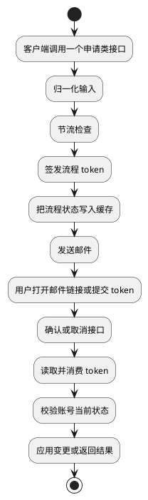
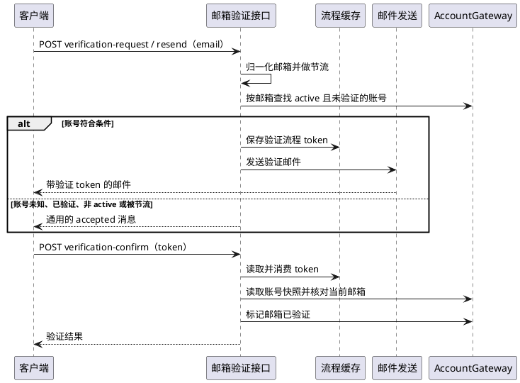
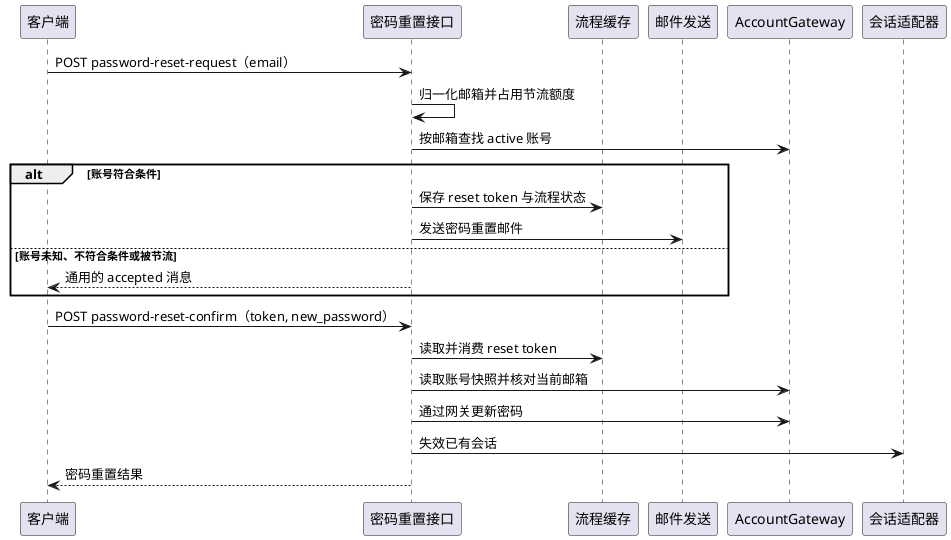
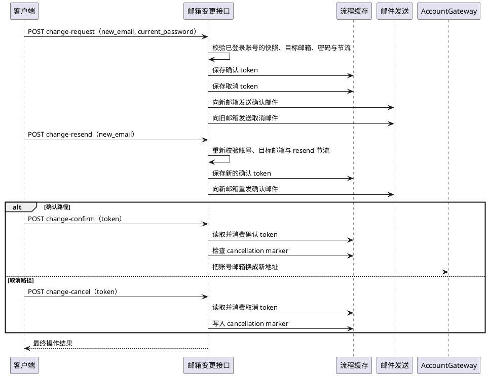

# 邮箱模块接口

本文档汇总独立 `module/email` 模块提供的 email 相关接口，并按当前实现说明请求入口、请求/响应字段、令牌流转、节流控制与最终状态变化。

业务项目需要这些接口时，需要在模块初始化阶段单独调用 `email.Register()`；`iam.Register(...)` 只注册账号、用户和 session 相关接口。内置 `module/email` 会在注册时安装默认 IAM `AccountGateway`，复制到业务项目后的 email service 代码应由项目侧安装自己的 `serviceemail.AccountGateway`。

## 接口总览

| 场景         | 路由                                         | 是否公开 | 请求字段                        | 响应字段          |
| ------------ | -------------------------------------------- | -------- | ------------------------------- | ----------------- |
| 邮箱验证申请 | `POST /api/iam/email/verification-request`   | 是       | `email`                         | `msg`             |
| 邮箱验证重发 | `POST /api/iam/email/verification-resend`    | 是       | `email`                         | `msg`             |
| 邮箱验证确认 | `POST /api/iam/email/verification-confirm`   | 是       | `token`                         | `verified`, `msg` |
| 邮箱变更申请 | `POST /api/iam/email/change-request`         | 否       | `new_email`, `current_password` | `msg`             |
| 邮箱变更重发 | `POST /api/iam/email/change-resend`          | 否       | `new_email`                     | `msg`             |
| 邮箱变更确认 | `POST /api/iam/email/change-confirm`         | 否       | `token`                         | `changed`, `msg`  |
| 邮箱变更取消 | `POST /api/iam/email/change-cancel`          | 是       | `token`                         | `canceled`, `msg` |
| 密码重置申请 | `POST /api/iam/email/password-reset-request` | 是       | `email`                         | `msg`             |
| 密码重置确认 | `POST /api/iam/email/password-reset-confirm` | 是       | `token`, `new_password`         | `reset`, `msg`    |

## 通用机制

- 所有 email 流程都依赖统一的 email flow token 存储能力，令牌状态保存在缓存中。
- 邮箱地址会先做 trim 与小写归一化，再用于查找账号、发信、生成 flow state 和 throttle scope。
- `request` / `resend` 类接口在发信前会做节流控制，避免短时间重复发送邮件。默认 request cooldown 为 1 分钟，resend cooldown 为 30 秒。
- token 默认有效期按流程区分：邮箱验证 24 小时，密码重置 30 分钟，邮箱变更确认/取消 30 分钟。
- 公开申请接口返回通用 `msg`，避免暴露账号是否存在、邮箱是否可用、账号是否已验证等敏感信息。账号未知、账号不符合条件或被节流时，接口仍返回同类 accepted message，并且不会创建 token 或发信。
- 确认/取消类接口会先消费一次性 token，再校验当前账号状态。即使后续状态校验失败，旧 token 也不可重复使用。
- email service 只通过 `serviceemail.AccountGateway` 读取账号快照、验证密码、更新密码或邮箱状态；具体用户表、密码哈希策略和 session 失效策略由 gateway/adapter 实现。

## 总体关系图

## 邮箱验证流程

### 说明

- `verification-request`：接受 `email`，在节流允许时查找对应账号；只有账号存在、处于 active 状态、邮箱仍匹配并且尚未验证时，才创建验证 token 并发送验证邮件。
- `verification-resend`：接受 `email`，逻辑与申请接口一致，但使用 resend throttle；账号未知、已验证、非 active 或被节流时返回通用 `msg`，不发信。
- `verification-confirm`：接受 `token`，消费验证 token 后加载账号；只有 token 中的邮箱仍等于账号当前邮箱时，才设置 `email_verified=true` 和 `email_verified_at`。如果账号已经验证过，返回 `verified=true` 和 `email already verified`。

### 流程图

## 密码重置流程

### 说明

- `password-reset-request`：接受 `email`，先按邮箱做 request throttle，再查找账号。只有账号存在、处于 active 状态并且邮箱仍匹配时，才创建 reset token 并发送 reset 邮件；账号未知、非 active 或被节流时返回通用 `msg`。
- `password-reset-confirm`：接受 `token` 与 `new_password`，消费 reset token 后加载账号；只有 token 中的邮箱仍等于账号当前邮箱时，才更新密码 hash、清除 `must_change_password` 并失效该账号已有 session。

### 流程图

## 邮箱变更流程

### 说明

- `change-request`：登录账号提交 `new_email` 和 `current_password`。接口会校验当前账号存在且处于 active 状态、当前邮箱存在、新邮箱非空且不同于当前邮箱、新邮箱未被其他账号占用，并通过当前密码重新认证。成功后向新邮箱发送确认邮件，向旧邮箱发送取消邮件。
- `change-resend`：登录账号提交 `new_email`。接口会重新校验当前账号和目标邮箱，并在 resend throttle 允许时重新签发一个确认 token，只向新邮箱发送确认邮件；不会重新发送取消邮件。被 resend throttle 命中时仍返回 `email change confirmation resent successfully`，但不创建 token 或发信。
- `change-confirm`：消费确认 token；如果对应邮箱变更已被取消，则返回 `changed=false`。否则加载账号，要求账号当前邮箱仍为旧邮箱，或已经等于新邮箱；确认成功时将账号邮箱切换为新邮箱，并设置 `email_verified=true`、`email_verified_at`、`last_email_changed_at`。
- `change-cancel`：消费取消 token；如果账号当前邮箱仍为旧邮箱，则写入一个短期 cancellation marker，阻止匹配的确认 token 后续完成变更。它不会更新用户表，也不是删除数据库中的 pending 记录。

### 流程图

## 关键安全约束

- 公开申请接口返回通用消息，避免账号枚举。
- flow token 必须具备过期时间，并在确认后立即消费删除。
- 密码重置成功后需要失效已有 session，降低旧凭证继续使用的风险。
- 邮箱变更确认前，需要再次校验账号当前邮箱状态，避免申请期间数据漂移导致错误覆盖。
- 邮箱变更申请需要当前密码重新认证；确认邮件发往新邮箱，取消邮件发往旧邮箱。
- 邮箱变更取消通过 cancellation marker 阻止同一账号、同一旧邮箱、新邮箱组合的确认 token 生效；新的同地址变更申请会清理旧 marker 后重新开始流程。
