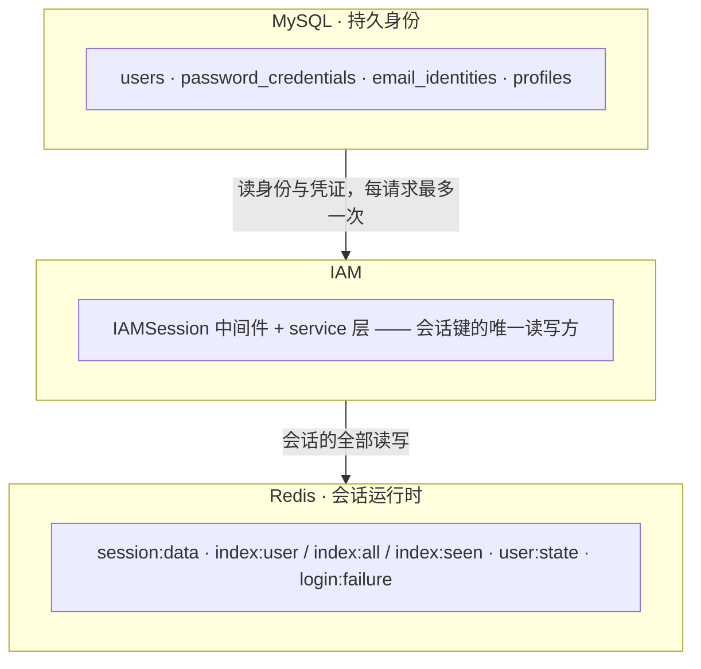
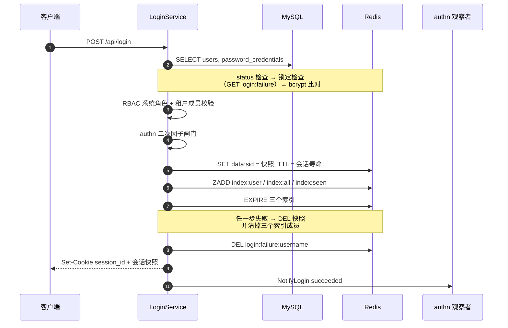
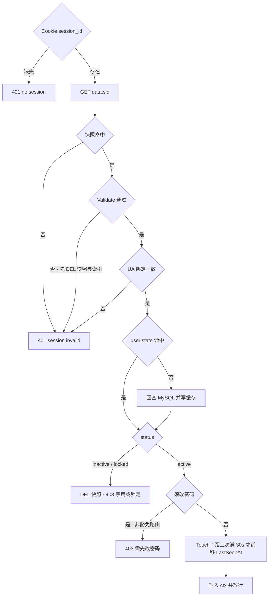
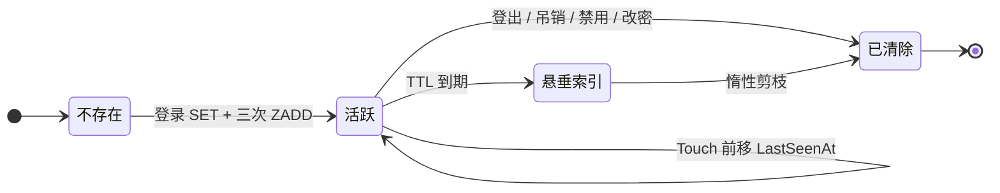
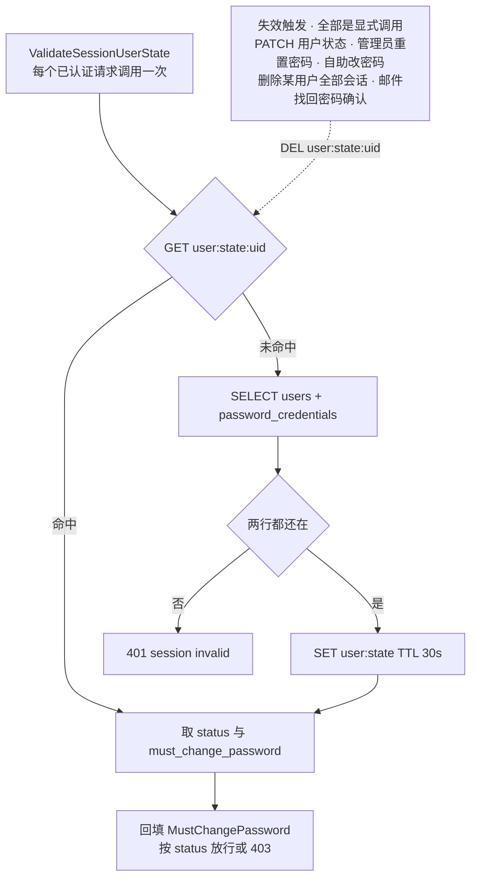
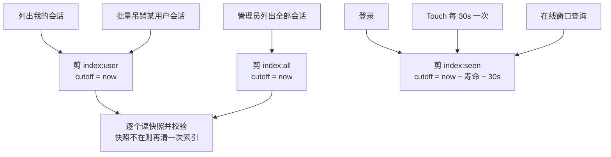

# IAM 会话与 Redis 键空间

会话是 IAM 里唯一不落库的东西。身份、凭证、邮箱和资料在 MySQL 的四张表里，而**会话的全部生命周期
由 Redis 的 6 个键表达**，两者只靠一个 user id 相连。

Redis 在这里不是缓存而是存储：没有它谁也认证不了，所以 `iam.Register()` 会在启动期检查
`Redis.Enabled`，没开就拒绝启动。

本文讲这 6 个键长什么样、谁写它、谁读它、什么时候消失。模块总览见 [README.md](README.md)，
多租户下的接口边界见 [TENANT.md](TENANT.md)。

## 存储归属

会话在 MySQL 里没有任何一行记录。唯一横跨两边的事实是 `MustChangePassword`：它同时存在于数据库的凭证行、
Redis 的会话快照和用户状态缓存里，改密码时三处各更新一遍。

## 六个键，三个命名空间

键的布局是 `serviceiamsession.Store` 的私有细节，构造器全部非导出。调用方拿不到键，也就无法用 Store
不提供的方式访问存储——这正是布局能改而不必让每个调用点同意的原因。

键名一律**先说角色、再说按什么键控**，所以前缀扫描一次只能命中一种角色，也没有任何一个键是另一个键的前缀。

| 键 | 类型 | 值 / score | TTL | 用途 |
| --- | --- | --- | --- | --- |
| `iam:session:data:<sid>` | String | Session 快照（JSON） | 会话寿命 | 会话本体 |
| `iam:session:index:user:<uid>` | ZSET | score = `ExpiresAt` 毫秒 | 会话寿命 | 某用户的会话：列表与批量吊销 |
| `iam:session:index:all` | ZSET | score = `ExpiresAt` 毫秒 | 会话寿命 | 全部会话：管理员总览 |
| `iam:session:index:seen` | ZSET | score = **`LastSeenAt`** 毫秒 | 会话寿命 + 一个 touch 间隔 | 谁在线，服务 `?online_within=5m` |
| `iam:user:state:<uid>` | String | `{status, must_change_password}` | 30s | 让认证不必每请求打两次库 |
| `iam:login:failure:<username>` | String 计数器 | `INCR` | 锁定窗口 | 连续失败的登录次数 |

真实键还带 `config.App.Redis.Namespace` 前缀，由 `redis.redisKey` 加上。

**三个命名空间按「键的作用域」而不是「谁写它」来分。** 会话拥有的一切随 `iam:session` 一起回收；
用户状态缓存和登录失败计数在它之外，因为它们描述的是一个用户和一个用户名，都比受其影响的任何会话活得久。

登录失败计数放在 Redis 而不是数据库列上，是因为增量要原子、窗口要能自己过期——「读一行、加一、写回」两样都给不了。

### 三个索引只有 score 不同

`index:user` 和 `index:all` 按 `ExpiresAt` 计分，所以凡是分数早于当下的成员都已耗尽。
`index:seen` 按 `LastSeenAt` 计分——这就是它存在的全部理由，因为「最近五分钟活跃过谁」
无法由一个按到期时间排序的索引回答。

它的保留期比另外两个长一个 touch 间隔：一个活会话的 `LastSeenAt` 最多滞后当下一个间隔，
所以按活跃判陈旧必须宽这一档，否则会把还活着的会话剪掉。

### 每个索引都需要两套清理

Redis 能让整个键过期，却**永远不能让 ZSET 的单个成员过期**。所以两套都要：

- **剪成员**（`ZREMRANGEBYSCORE`）保证索引**内容**诚实。没有它，会话本体过期后 id 还赖在索引里，会话总数虚高。
- **键 TTL**（`EXPIRE`）保证索引**键本身**不会比它命名的所有会话活得久。没有它，一个没人读的索引永远不会被回收。

键 TTL 是模块的属性，不是正在写入的那个会话的属性：它取自配置的会话寿命，而不是本次会话的剩余时间。
若由成员决定，一个快过期的会话就能把一个还有长命成员依赖的共享键提前判死。

**没有定时任务。** 剪枝发生在读取或延长索引的那些路径上——一次登录、一次 touch、一次列表。

## 登录

会话的创建不是一次原子写：快照 `SET` 之后还有三次 `ZADD` 和三次 `EXPIRE`。任何一步失败都会把已经写下的
部分擦掉——一个索引找不到的活会话既列不出来也吊销不掉，那比一次失败的登录糟得多。

密码或二次因子失败时走另一条路：`INCR login:failure:<username>`，达到阈值即锁定。
**窗口只在第一次失败时设定**，后续失败不延长它——否则持续失败就能把账号无限期锁死。

锁定的拒绝措辞与密码错误完全一致。说「已锁定」等于回答了一个调用方无权问的问题：
任何人都能对一个猜测的用户名故意失败五次，再从两种回复的差别里读出这个账号是否存在。

## 每个已认证请求

`Validate` 只校验快照本身四件事：id 与快照一致、user_id 非空、`ExpiresAt` 非零、未过期。
**用户**是否还能继续认证是另一个问题，通过用户状态缓存问数据库——因为那个答案会在快照不变的情况下改变。

**每一种拒绝的措辞完全相同。** 拒绝的理由是有层次的——存储里没有的快照、过期的快照、发给另一个浏览器的快照——
逐条回答等于把服务端的检查项交给一个持有失窃 cookie 的人：他可以每次只变一个条件，从回复里读出服务端反对的是哪一项。
持有有效会话的人也不会因为这个区分得到任何信息，所以只有日志留着它。

**UA 绑定**比对 OS、Platform、Engine、Browser 四项，任一不符即拒——换浏览器或换操作系统必须重新登录。
`MustChangePassword` 为真时的豁免路由只有四条：`POST /api/iam/change-password`、`POST /api/logout`、
`GET` 与 `DELETE /api/iam/session/current`。

稳态成本是**两次 Redis 读、零写入**：touch 间隔是拿调用方手上已有的快照判断的，在发出任何命令之前。

## 会话状态

**快照存在，会话就可用。** 吊销是删键，过期是 TTL 到期——两者都没有留下可命名的状态，
所以 `Session` 上没有 status 字段。键要么在要么不在，没有哪个读取方需要跟一个字段就「它算不算还活着」达成一致。

**活跃 —— id 键在且未过 `ExpiresAt`。悬垂索引 —— id 键已随 TTL 消失、三个 ZSET 里的成员还在。**
后者是这套设计必然存在的中间态，也是每个列表接口都必须先剪枝再逐个读快照的原因。

## 用户状态缓存

有两件事会在会话不变的情况下改变：管理员禁用账号，以及重置密码把 `must_change_password` 置真。
只信登录时的快照，就意味着一个被禁用的账号能一直用到会话自然过期。

所以每个已认证请求都要重新确认这两件事——数据源是 MySQL，两次查询，而这个缓存就挡在这两次查询前面。

「两行都还在」这一步意味着：**删掉一个用户会立刻废掉他的全部会话**，不依赖任何显式失效调用。

30 秒 TTL 是给没人记得失效的路径兜底的。那些显式 `DEL` 调用则让已知路径立刻生效，而不是等最多 30 秒。

## 惰性剪枝

`index:user` 与 `index:all` 按 **ExpiresAt** 剪，`index:seen` 按 **LastSeenAt** 剪——
两套 score 语义不能互换，cutoff 由调用方给，就是为了让这件事说得出口。

剪枝只保证索引不虚高，不保证索引里的每个成员都还有快照，所以列表接口读完索引还要逐个校验。

## TTL 节奏

| TTL | 长度 | 它决定什么 |
| --- | --- | --- |
| `session:data` 与三个索引 | 会话寿命（默认 8h） | 会话何时结束 |
| touch 间隔 | 30s | 活跃时间戳的写放大 |
| `user:state` | 30s | 禁用账号的生效延迟上限 |
| `login:failure` | 锁定窗口（默认 15m） | 锁定何时解除 |

秒级的那几个决定的是「写放大」与「一致性延迟」，跟会话何时结束无关。

**活跃不会续期。** `ExpiresAt` 在登录那一刻定死，`TouchSession` 只前移 `LastSeenAt`，
不推动会话的右端。所以「空闲 30 分钟登出」这类语义当前表达不出来，能表达的只有「登录后 8 小时一律重新登录」。

`login:failure` 的窗口**只在第一次失败时设定、不被后续失败延长**——延长的话，攻击者持续失败就能把账号无限期锁死。

## 吊销路径

| 触发 | 入口 | data 键 | index:user | index:all + seen | user:state | Cookie |
| --- | --- | --- | --- | --- | --- | --- |
| 登出 | `POST /api/logout` | DEL 当前 | ZREM | ZREM | — | 清 |
| 删当前会话 | `DELETE /iam/session/current` | DEL 当前 | ZREM | ZREM | — | 清 |
| 删指定会话 | `DELETE /iam/sessions/:id` | DEL 目标 | ZREM | ZREM | — | 仅当目标是自己 |
| 踢掉其他设备 | `DELETE /iam/sessions/others` | 逐个 DEL | 剪枝 + 逐个 ZREM | ZREM | — | 保留 |
| 删我的全部会话 | `DELETE /iam/sessions` | 逐个 DEL | 逐个 ZREM + DEL 整键 | ZREM | DEL | 清 |
| 管理员删单个会话 | `DELETE /iam/admin/sessions/:id` | DEL 目标 | ZREM | ZREM | — | 仅当目标是自己 |
| 管理员删某用户会话 | `DELETE /iam/admin/users/:id/sessions` | 逐个 DEL | 逐个 ZREM + DEL 整键 | ZREM | DEL | 仅当目标是自己 |
| 禁用 / 锁定用户 | `PATCH /iam/admin/users/:id` | 逐个 DEL | 逐个 ZREM + DEL 整键 | ZREM | DEL | — |
| 恢复用户为 active | `PATCH /iam/admin/users/:id` | — | — | — | DEL | — |
| 管理员重置密码 | `POST /iam/reset-password` | 逐个 DEL | 逐个 ZREM + DEL 整键 | ZREM | DEL | — |
| 自助修改密码 | `POST /iam/change-password` | 除当前外逐个 DEL | 剪枝 + 逐个 ZREM | ZREM | DEL | 保留 |
| 邮件找回密码确认 | `POST /iam/email/password-reset-confirm` | 逐个 DEL | 逐个 ZREM + DEL 整键 | ZREM | DEL | — |

索引指名而 Redis 已经没有的快照是陈旧成员，不是失败：它被剪掉，其余会话照常删除，
这让每一种批量吊销都保持幂等。

`index:all` 与 `index:seen` 在所有吊销路径上的动作完全一致，因此合并成一列；它们只是 score 语义不同的两个全局索引。

批量吊销统一走 `Store.DeleteUserSessions`：**错误一律返回**，吞不吞由调用方显式表态——
状态已落库的场景记日志放行，其余上报。

改密码**先写库、后吊销**。反过来会为一次写库可能失败的改动就把用户从其他设备上踢下去，
留给他一个旧密码和一堆没了的会话。

## 边界

**Redis 不可用时 IAM 谁也认证不了。** 会话不落库，所以没有降级路径。`iam.Register()` 因此在启动期检查
`Redis.Enabled`，没开就拒绝启动。需要注意框架层的行为并不整齐：typed `redis.Cache` 在禁用时返回
`ErrRedisIsDisabled`，而 `ZAdd` / `ZRem` / `SetNX` / `Expire` / `Del` 是静默 no-op，`SetNX` 甚至返回
`true`。启动期那道检查就是为了让这种不对称永远没机会发生。

**会话不会因活跃而续期。** 见上面的 TTL 节奏。

**锁定按用户名计数，因此可被用来锁别人。** 任何人对一个已存在的用户名故意失败
`IAM_LOGIN_FAILURE_LIMIT` 次，就能把它锁上一个窗口。缓解只有「窗口要短」，
真正的解法是在 `/api/login` 前面加一道按 IP 的限流。计数只对**存在的账号**做，
否则任何人都能用编造的用户名往 Redis 里灌键。

**会话不是 JWT。** 它们是不透明 id，cookie 里不携带关于主体的任何信息。
`authn/jwt` 独立存在，与本模块不共享任何东西。

**IAM 不写 role binding。** 在这里创建的用户不属于任何租户，直到 authz 把它绑定到一个角色。
见 [TENANT.md](TENANT.md)。
