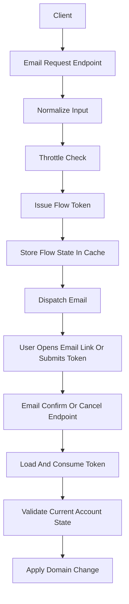
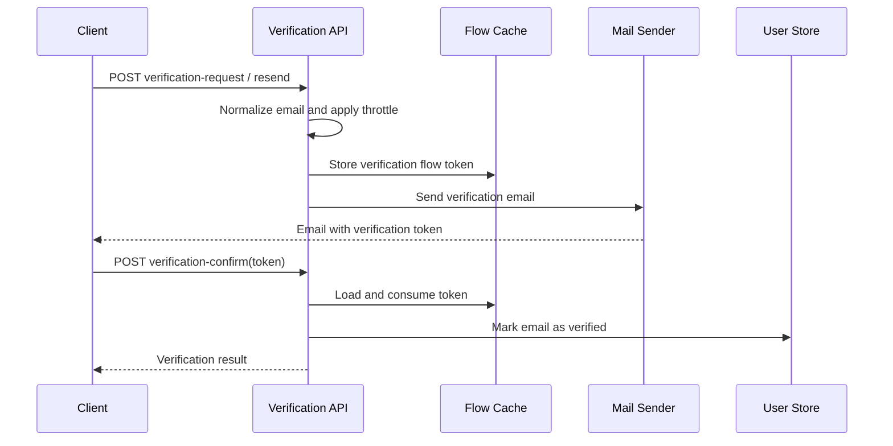
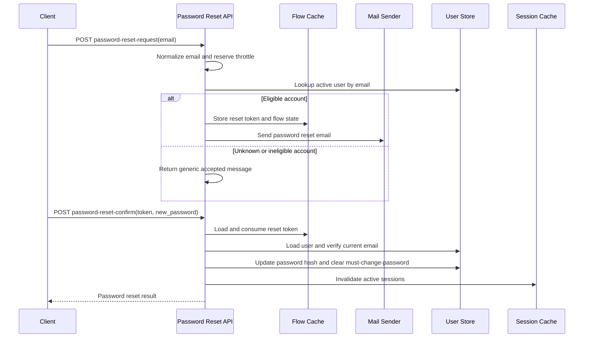
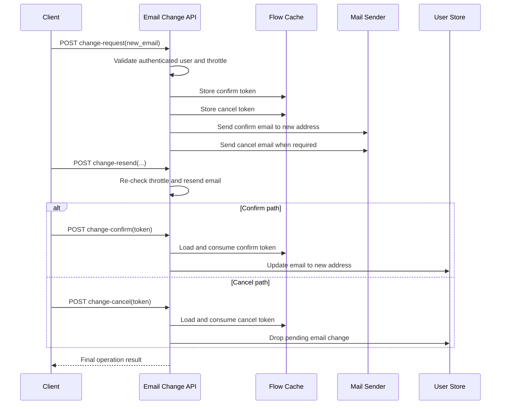

# IAM Email Interfaces

本文档汇总 `module/iam` 下所有 email 相关接口，并给出各流程的请求入口、令牌流转、节流控制与最终状态变化。

## 接口总览

| 场景 | 路由 | 是否公开 |
| --- | --- | --- |
| 邮箱验证申请 | `POST /api/iam/email/verification-request` | 是 |
| 邮箱验证重发 | `POST /api/iam/email/verification-resend` | 是 |
| 邮箱验证确认 | `POST /api/iam/email/verification-confirm` | 是 |
| 邮箱变更申请 | `POST /api/iam/email/change-request` | 否 |
| 邮箱变更重发 | `POST /api/iam/email/change-resend` | 否 |
| 邮箱变更确认 | `POST /api/iam/email/change-confirm` | 否 |
| 邮箱变更取消 | `POST /api/iam/email/change-cancel` | 是 |
| 密码重置申请 | `POST /api/iam/email/password-reset-request` | 是 |
| 密码重置确认 | `POST /api/iam/email/password-reset-confirm` | 是 |

## 通用机制

- 所有 email 流程都依赖统一的 email flow token 存储能力，令牌状态保存在缓存中。
- `request` / `resend` 类接口在发信前会做节流控制，避免短时间重复发送邮件。
- 对公开接口，响应尽量保持稳定，避免暴露账号是否存在、邮箱是否有效等敏感信息。
- 确认类接口会消费一次性 token，成功后旧 token 不可重复使用。

## 总体关系图

## 邮箱验证流程

### 说明

- `verification-request`：为目标邮箱创建验证流程并发送验证邮件。
- `verification-resend`：在节流允许时重新发送验证邮件。
- `verification-confirm`：消费验证 token，完成邮箱验证状态更新。

### 流程图

## 密码重置流程

### 说明

- `password-reset-request`：接受邮箱输入，进行节流校验，查找可重置的激活用户后发出 reset 邮件。
- `password-reset-confirm`：消费 reset token，校验邮箱与用户当前状态一致后更新密码，并使现有会话失效。

### 流程图

## 邮箱变更流程

### 说明

- `change-request`：登录用户提交新邮箱，系统生成确认 token 与取消 token。
- `change-resend`：在节流允许时重新向新邮箱发送确认邮件。
- `change-confirm`：消费确认 token，将账号邮箱切换为新邮箱。
- `change-cancel`：消费取消 token，撤销待处理的邮箱变更。

### 流程图

## 关键安全约束

- 公开申请接口返回通用消息，避免账号枚举。
- flow token 必须具备过期时间，并在确认后立即消费删除。
- 密码重置成功后需要失效已有 session，降低旧凭证继续使用的风险。
- 邮箱变更确认前，需要再次校验用户当前邮箱状态，避免申请期间数据漂移导致错误覆盖。
